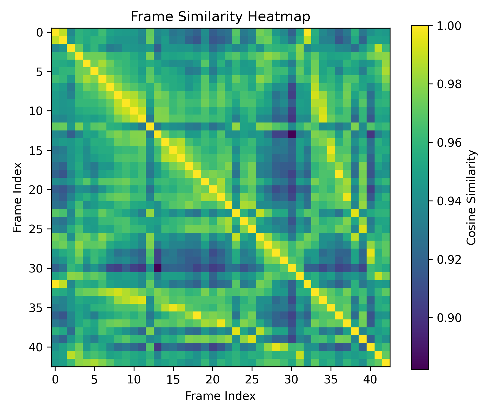

Mini GACS Prototype – Mood & Style Embedding Pipeline

A verification-first affective computing prototype inspired by GenTA GACS

## Example Output



Overview

This project demonstrates a minimal affective-computing pipeline that compares the perceived vibe (mood/style) of visual content.

Instead of classifying objects (car, person, product), the system compares semantic similarity between frames using embeddings from a pretrained vision model.

Goal:

Determine whether two visuals feel similar even if they are visually different.

Key Idea

We approximate emotional similarity using embedding distance.

CLIP embeddings capture high-level properties such as:

lighting mood

composition

color tone

aesthetic style

atmosphere

Similarity in embedding space ≈ similarity in perceived feeling

Pipeline

Load short art/marketing videos

Extract representative frames at intervals

Generate embeddings using CLIP

Compute cosine similarity between frames

Retrieve similar frames + visualize heatmap

## Cross-Video Similarity Result

The system compares overall mood between videos by averaging frame embeddings.

Example output:

video1.mp4 ↔ video2.mp4 : 0.526

This indicates the videos share partial stylistic similarity but different visual tone, demonstrating perceptual comparison rather than object recognition.

Repository Structure
src/
  extract_frames.py      # video → frames
  compute_embeddings.py  # frames → embeddings
  similarity.py          # retrieval + heatmap
  tests.py               # verification checks

data/ (ignored in git)
  videos/
  frames/
  metadata.csv
  embeddings.npy
  index.json

results/
  heatmap.png
How to Run
pip install -r requirements.txt

```bash
python src/extract_frames.py
python src/compute_embeddings.py
python src/similarity.py
python src/tests.py
```
Verification-First Engineering

The pipeline validates correctness instead of assuming it.

Check	Purpose
File existence	Prevent silent failures
FPS fallback	Handle corrupted videos
Embedding shape	Model output validation
NaN detection	Numerical stability
Self similarity	Sanity test
Retrieval consistency	Semantic correctness

All verification tests pass successfully.

Limitations

Visual only (no audio)

No temporal modeling

Frame-independent analysis

Similarity ≠ human emotion ground truth

This is a perceptual proxy, not emotion classification.

Toward a Real GACS Engine

Future extensions:

Multimodal affect

audio tone

speech energy

rhythm intensity

Temporal modeling

emotional progression across time

Performance learning
Connect embeddings to:

CTR

watch time

ROAS

Learn which feel performs best.

Use of AI Tools

AI assistants (ChatGPT/Copilot) were used for scaffolding.

All outputs were manually verified:

fixed model output handling

corrected embedding loop

added assertions & tests

handled edge cases

Architecture and debugging decisions were human-validated.

Key Insight

Traditional vision systems answer:

What is in the image?

This system asks:

How does the image feel?

## Design Choice

CLIP was selected because affective similarity is semantic, not pixel-level.
Traditional features such as color histograms or classification logits cannot capture aesthetic tone.

Embedding distance is treated as a perceptual proxy — not emotion prediction.
This aligns with the GACS philosophy of measuring *feel* rather than labeling emotion.

# Example Result Interpretation

Two different videos were compared using cross-video embedding similarity.

Observed similarity score:
video1 ↔ video2 ≈ 0.52

Meaning:
The videos are visually different but share partial aesthetic tone 
(color palette / lighting / composition).

This demonstrates the system measures perceptual similarity rather than object identity.